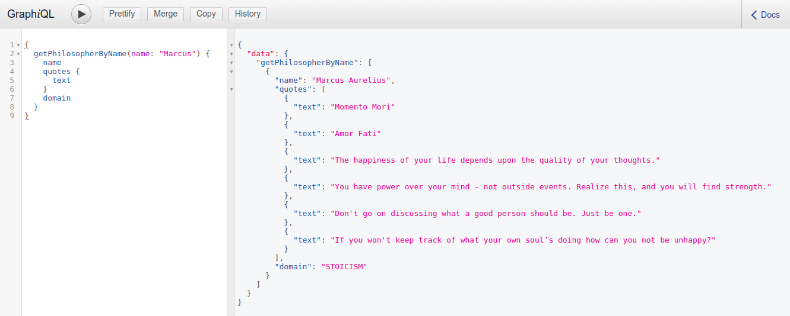

# philosophyapi_python_graphql_docker

## Launch Philosophy API
Run `launch_philosophiapi.sh`  

## Consumatie
De font-end consumatie bevindt zich op [http://127.0.0.1:5000](http://127.0.0.1:5000)  

**GraphQLi**  
De GraphQLi interface is te vinden op de route
[/graphql](http://127.0.0.1:5000/graphql)

**Consumatie**  
De andere routes zijn te vinden in de navigatiebar op de route [/philosophers](http://127.0.0.1:5000/philosophers)

## Afbeeldingen
### GraphQLi interface

### Consumatie interface

## Technologies
* Python (Flask, Graphene)
* GraphQL
* Docker
